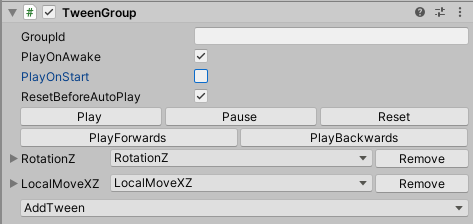
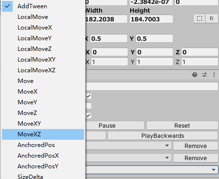
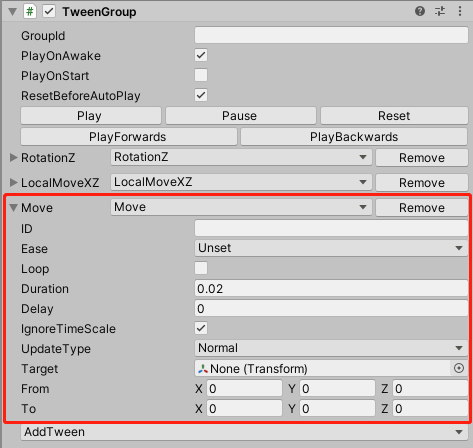
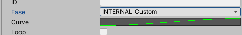
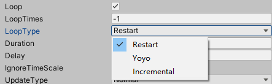
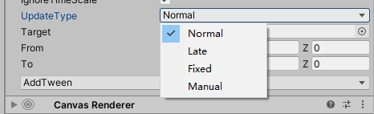
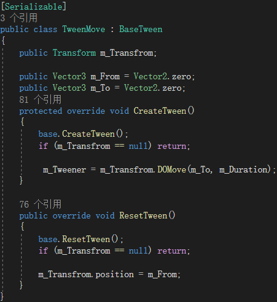

# DoTweenExtension
### 关于DoTween的一个可视化编辑扩展组件

DoTween用来做一些UI动画非常方便，但是调用Tween动画一般通过transform.DoXXX()这样的方式，就不是很方便。记得以前用NGUI的时候有个iTween，通过挂载组件的方式编辑Tween动画，感觉就挺方便的。虽然DoTween也有一个TweenAnimation组件，但是感觉用起来还是不太方便，而且还有一些bug。于是自己封装了一个可视化的编辑扩展组件，如上图。
主要由三个部分构成，TweenGroup和BaseTween，以及继承BaseTween的各种具体的Tween，TweenMove，TweenScale等。

#### 关于使用
先看一下参数：
GroupId：指定一个自定义的Id，用于如果一个对象上挂在了多个TweenGroup组件时区分用。
PlayOnAwake 与 PlayOnStart：是否在OnAwake和OnStart时自动播放。勾选之后还有一个ResetBeforeAutoPlay参数，标记自动播放的时候是否Reset一下Tween参数。
一排按钮，Play，Pause，Reset，PlayForwards，PlayBackwards，用于编辑的时候播放，暂停，重置，正播，倒播等预览操作。
然后有一个AddTween的枚举列表，点开大概是这样：

可以选择一个需要的动画类型，选一个MoveTween看一下：

点击左边名字前面的箭头可以把Tween收起或展开。
点开Move的枚举列表可以切换不同的Tween类型，Remove按钮移除该Tween.
参数：
ID：一个自定义参数，同样用于有多个Tween的时候用于区分。
Ease：动画曲线选择，点开可以选择DoTween内置的一些动画曲线，也可以选择一个自定义曲线，会多出一个Curve参数，编辑自定义曲线。

Loop：是否循环播放，勾选之后，多出两个参数：
LoopTime：设置播放次数，-1表示一直循环播放
LoopType：设置循环播放的类型，Restart, yoyo, Incremental三种。

Duration：一次播放时长，当Tween设置为循环播放时，这个Duration表示的是每次播放时长。
Delay：延迟播放。
IgnoewTimeScale：是否不受TimeScale影响。
UpdateType：动画更新方式，Update或LateUpdate或FixedUpdate或手动。

Target：选择一个动画对象，根据Tween类型的不同，此处Target的类型也不同，可能为Transform，Image，CanvasGroup等。
From 和 To：Tween的初始状态和目标状态，根据Tween类型的不同，也会不同，可能为Vector3，float，Color等类型。
#### 关于使用方式：
通过AddTween选择不同的Tween类型，并设置好动画参数，一个TweenGroup下可包含多个Tween，并且可以是相同类型的Tween，每个Tween都是相互独立的，这在TweenGroup内部是将它们存储在了一个List中。通过调用TweenGroup的接口播放，暂停，重置或倒播，TweenGroup会List中的所有Tween做同样的操作，所以实际上这里的TweenGroup就是多个Tween的一个组合调度接口，通过设置不同Tween实例的参数，延迟，时长，曲线等，控制多个tween的统一播放，实现动画效果。
##### 由于编辑调整动画这个事情本身是应该是应该由美术同学来把控的，但是由于美术同学对DoTween插件的不熟悉，经常这个事情被安排给开发同学做，于是就有了美术和策划同学站在程序员背后指点调参的画面。 如果有一个可视化编辑DoTween的工具的话，就可以把很多的动画编辑直接让美术同学自己去调了，开发同学只需要在合适的时机调用Play。

### 关于一些实现:
**TweenGroup.cs**
```csharp
public string m_GroupId;
public bool m_ResetBeforeAutoPlay = true;
public bool m_PlayOnAwake;
public bool m_PlayOnStart = true;

[SerializeReference]
public List<BaseTween> m_Tweens = new List<BaseTween>();
private TweenCallback _onStart;
private TweenCallback _onComplete;
public TweenCallback onStart;
public TweenCallback onComplete
```
主要是开了一个List用来存储该TweenGroup下的所有BaseTween (BaseTween各种Tween的基类)，还有两个回调方法，onStart和onComplete，分别在TweenGroup开始播放和结束播放的时候调起。
**[SerializeReference]特性标签：**
Unity2019以前版本的序列化标签**[SerializeField]**不自持对多态的序列化，导致继承自BaseTween的Tween子类(MoveTween,ScaleTween)等无法反序列化(反序列化的时候只能拿回一个BaseTween实例)，Unity2019之后的版本对序列化这块新增了SerializeReference标签，支持多态的正反序列化。而该TweenGroup组件实际是用2018版本的时候写的，那时的办法是去掉了这些继承的子类，把各种Tweem的方法集成到BaseTween里，通过枚举和Switch方法来区分控制，确实后续阅读和扩展起来会比较麻烦一点，好在2019多了这个标签，于是又把BaseTween拆了出来，不同类型的Tween独立管理，扩展起来会方便一些。
另外TweenGroup还有一些接口方法，Play，Reset，Kill等.
还有一个GetTweensById方法，通过Tween上设置的id获取具体的Tween实例，可用于运行时修改该参数等。
```csharp
public BaseTween[] GetTweensById(string id)
{
    return null;
    if (string.IsNullOrEmpty(id))
    {
        return m_Tweens.ToArray();
    }
    return m_Tweens.FindAll(tw => id.Equals(tw.m_Id)).ToArray();
}
```
**BaseTween.cs**
BaseTween里封装了一些各种Tween类型的通用参数和方法，Id，Ease，Duration，Delay，还有Play，Pause，PlayFordwards，PlayBackwards，Kill等。
另外主要有两个接口用于给子类继承，实现不同Tween类型的创建和Reset操作，主要是由于不同Tween类型的创建接口是不一样的，DoMove,DoScale等。
```
protected virtual void CreateTween() 
{
    Kill();
}

public virtual void ResetTween()
{
    Kill();
}
```
看一个MoveTween的示例：

新增Tween类型的时候也只需继承一下BaseTween，实现CreateTween和ResetTween接口，并把Tween类打上Serializable标签。

#### 关于编辑器实现
其实主要的是编辑器代码，编辑器代码只有一个，不同Tween的编辑器菜单等都集成在一个类里。
TweenGroupInspector.cs
首先有一个m_TweenTypes的列表，收入所有的Tween类型，用于创建编辑器上的枚举列表，新增Tween的时候也应该将它的类型添加到这个List里。
```csharp
List<Type> m_TweenTypes = new List<Type>
{
	typeof(TweenLocalMove),
	...
	typeof(TweenShakeScale),
};
```
其它主要是一些通用编辑菜单的具体实现，一般来说后续不需不会有修改。
对于各类Tween的非通用属性实现，有一个DrawTweenProperty方法，在该方法中判断Tween的具体类型，实现不同Tween编辑器的属性编写，类似这样：
```csharp
void DrawTweenProperty(BaseTween tw)
{
    if (tw is TweenLocalMove)
    {
        var _tw = tw as TweenLocalMove;
        _tw.m_Transfrom = EditorGUILayout.ObjectField("Target", _tw.m_Transfrom, typeof(Transform), true) as Transform;
        _tw.m_From = EditorGUILayout.Vector3Field("From", _tw.m_From);
        _tw.m_To = EditorGUILayout.Vector3Field("To", _tw.m_To);
    }
    else if (tw is TweenLocalMoveX)
    {
        var _tw = tw as TweenLocalMoveX;
        _tw.m_Transfrom = EditorGUILayout.ObjectField("Target", _tw.m_Transfrom, typeof(Transform), true) as Transform;
        _tw.m_From = EditorGUILayout.FloatField("From", _tw.m_From);
        _tw.m_To = EditorGUILayout.FloatField("To", _tw.m_To);
    }
    ...
    ...
}
```
主要是实现一下动画对象Target，From和To字段，因为这些字段类型会不同。
这部分通过if else的方法实现着实有点难看，后续扩展可能会有点不舒服。
一开始倒是也有想过将这块再拆出来，搞一个Tween编辑器基类，和子类来拆分，不过这样的话每次创建编辑器的时候(点选查看Inspector的时候)，都要创建一遍编辑器下对应的各种Tween类型实例，并且拆分后的结构和逻辑也比较复杂，而每个Tween编辑器类对应的绘制属性的逻辑又比较简单，所以就还是选择集中到这个DrawTweenProperty方法里了，后续有扩展就正价else if() 鹅鹅鹅。


